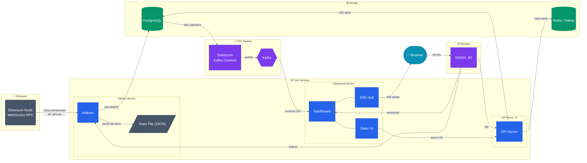

# Architecture

## Data Flows

1. **Indexing**: Ethereum → Indexer → PostgreSQL
2. **CDC**: PostgreSQL → Debezium → Kafka → Dashboard → SSE → Browser
3. **Query**: Browser → Gateway → API Server → Redis (cache-aside) → PostgreSQL
4. **UI**: Browser loads static assets from Dashboard, calls API Server for historical data
