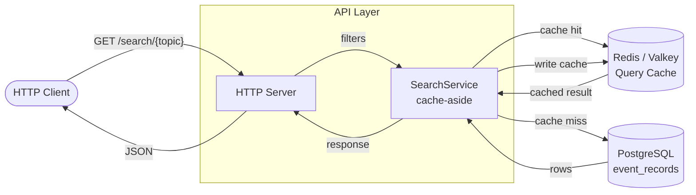
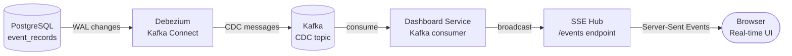

# eth-indexer

A production-grade Ethereum event indexer that captures smart contract events and stores them in PostgreSQL for fast, structured querying. Structured as a Go monorepo with three independent services and two shared libraries.

## Features

- **Deterministic indexing** - Replaying blocks produces identical results
- **Idempotent operations** - Primary key is `(tx_hash, log_index)`; duplicates are silently ignored
- **Reorg-safe** - Only indexes confirmed blocks (configurable depth)
- **High throughput** - Bulk insertion with automatic block range chunking
- **Search API** - RESTful API with flexible filtering and cursor-based pagination
- **Resumable** - Persists indexer state per event, safe to restart
- **Real-time** - WebSocket-based block monitoring
- **Redis caching** - Query result caching with configurable TTL
- **Real-time dashboard** - Kafka CDC + Server-Sent Events UI
- **Docker-ready** - Complete containerization with Docker Compose
- **Kubernetes-ready** - Full manifests for minikube/production deployment
- **Monitoring** - Prometheus + Grafana + Kafka exporter

## Repository Layout

```
libs/
  common/       — shared types: EventRecord, ComparisonFilter[T], PagingOptions[CursorT]
  config/       — shared helpers: PostgresOptions, LoadPostgresFromEnv, CreatePgConnPool
services/
  indexer/      — standalone Ethereum event indexer
  api-server/   — standalone HTTP query service
  dashboard/    — real-time UI with Kafka CDC and SSE
monitoring/
  prometheus/   — prometheus.yml scrape config
  grafana/      — datasources, dashboard provider, dashboard JSON
  debezium/     — register-connector.sh
k8s/
  namespace.yaml, secrets.yaml, gateway.yaml, external-services.yaml
  kafka-connect/, dashboard/, indexer/, api-server/, monitoring/
scripts/
  k8s/          — cluster-up.sh, cluster-down.sh, test-cluster.sh
  anvil/        — deploy-contracts.sh, wait-for-rpc.sh
  test/         — setup-test-env.sh, teardown-test-env.sh
  monitor.sh, psql.sh
```

## Quick Start

### Local Development with Docker Compose

```bash
git clone <repository>
cd eth-indexer
cp .env.example .env
# Edit .env with your Ethereum RPC URL and contract config
```

Start all services:
```bash
make local-up
# or
docker compose -f docker-compose.local.yml up -d
```

Services started:
- **Anvil** - Local Ethereum node (port 8545)
- **PostgreSQL** - Event storage (port 5434)
- **Valkey (Redis)** - Query cache (port 6380)
- **Kafka + Zookeeper** - Event streaming
- **Kafka Connect + Debezium** - CDC connector (port 8083)
- **indexer** - ERC20 event indexer
- **indexer-staking** - StakingPool event indexer
- **indexer-uniswap** - UniswapPool event indexer
- **api-server** - HTTP query API (port 8082)
- **dashboard** - Real-time event UI (port 8090)
- **gateway** - Nginx reverse proxy (port 3003)

Monitor indexing:
```bash
./scripts/monitor.sh
```

Query events:
```bash
curl http://localhost:8082/search/Transfer | jq
```

### Running Services Directly (Go)

```bash
go mod download
make build-all
```

Each service is configured via environment variables:

```bash
# Indexer
ETHEREUM_RPC_URL=wss://mainnet.infura.io/ws/v3/YOUR_KEY \
INDEXER_CONTRACT_ADDRESSES=0xA0b86991c6218b36c1d19D4a2e9Eb0cE3606eB48 \
INDEXER_EVENT_NAMES=Transfer,Approval \
INDEXER_ABI_PATH=./abi.json \
POSTGRES_HOST=localhost POSTGRES_PORT=5432 \
POSTGRES_DB=eth_indexer POSTGRES_USER=postgres POSTGRES_PASSWORD=postgres \
make run-indexer

# API Server
POSTGRES_HOST=localhost POSTGRES_PORT=5432 \
POSTGRES_DB=eth_indexer POSTGRES_USER=postgres POSTGRES_PASSWORD=postgres \
REDIS_HOST=localhost REDIS_PORT=6379 \
TOPICS=Transfer,Approval \
make run-api-server
```

## Configuration

All services are configured via **environment variables**. See `.env.example` for a full list.

### Indexer Environment Variables

| Variable | Required | Default | Description |
|----------|----------|---------|-------------|
| `ETHEREUM_RPC_URL` | Yes | - | Ethereum WebSocket RPC endpoint (`wss://`) |
| `INDEXER_CONTRACT_ADDRESSES` | Yes | - | Comma-separated contract addresses |
| `INDEXER_EVENT_NAMES` | Yes | - | Comma-separated event names (e.g. `Transfer,Approval`) |
| `INDEXER_ABI_PATH` | Yes | - | Path to ABI JSON file |
| `INDEXER_CONFIRMED_AFTER` | No | `12` | Blocks to wait before indexing (reorg protection) |
| `INDEXER_OFFSET_BLOCK_NUMBER` | No | `0` | Starting block number |
| `INDEXER_STATUS_FILE_PATH` | No | `/var/lib/indexer/state.json` | Path to persist indexer state |
| `POSTGRES_HOST` | Yes | - | PostgreSQL host |
| `POSTGRES_PORT` | No | `5432` | PostgreSQL port |
| `POSTGRES_DB` | Yes | - | Database name |
| `POSTGRES_USER` | Yes | - | Database user |
| `POSTGRES_PASSWORD` | Yes | - | Database password |
| `POSTGRES_MAX_CONNECTIONS` | No | `10` | Max connection pool size |

### API Server Environment Variables

| Variable | Required | Default | Description |
|----------|----------|---------|-------------|
| `API_PORT` | No | `8080` | HTTP server port |
| `API_TTL` | No | `60` | Redis cache TTL in seconds |
| `TOPICS` | Yes | - | Comma-separated allowed event topics |
| `REDIS_HOST` | Yes | - | Redis/Valkey host |
| `REDIS_PORT` | No | `6379` | Redis port |
| `REDIS_PASSWORD` | No | - | Redis password |
| `REDIS_DB` | No | `0` | Redis database index |
| `POSTGRES_*` | Yes | - | Same as indexer |

### Dashboard Environment Variables

| Variable | Required | Default | Description |
|----------|----------|---------|-------------|
| `KAFKA_BOOTSTRAP_SERVERS` | No | `kafka:9092` | Kafka broker address |
| `SOURCE_TOPIC` | No | `eth-indexer.public.event_records` | Debezium CDC topic |
| `TOPICS` | No | `Transfer,Approval` | Event names to display |
| `UI_PORT` | No | `8090` | Dashboard HTTP port |
| `API_SERVER_URL` | No | `http://api-server` | API server base URL |

## API Endpoints

Full API documentation: [API.md](API.md)

### Health Check
```
GET /health  →  200 OK
```

### Search Events
```
GET /search/{topic}?[filters]
```

**Response:**
```json
{
  "count": 150,
  "result": [
    {
      "topic": "Transfer",
      "contract_address": "0xA0b86991c6218b36c1d19D4a2e9Eb0cE3606eB48",
      "tx_hash": "0x023814...",
      "block_hash": "0xf4c508...",
      "block_number": 24633117,
      "log_index": 0,
      "data": {
        "from": "0x9250e9...",
        "to": "0xf8e16e...",
        "value": 500
      },
      "timestamp": "2026-03-11T08:47:18.630617Z"
    }
  ],
  "next_cursor": "..."
}
```

### Filter Parameters

| Parameter | Format | Example |
|-----------|--------|---------|
| `contract_address` | Comma-separated addresses | `?contract_address=0xA0b8...` |
| `tx_hash` | Exact match | `?tx_hash=0x0238...` |
| `block_hash` | Exact match | `?block_hash=0xf4c5...` |
| `log_index` | Comma-separated integers | `?log_index=0,1,2` |
| `block_number` | JSON comparison object | `?block_number={"gte":100,"lte":200}` |
| `timestamp` | JSON comparison object | `?timestamp={"gte":"2026-01-01T00:00:00Z"}` |
| `data` | JSON containment | `?data={"from":"0x..."}` |

Comparison operators: `gte`, `lte`, `gt`, `lt`, `eq`

**Examples:**
```bash
# Block range
curl --get http://localhost:8082/search/Transfer \
  --data-urlencode 'block_number={"gte":24633120,"lte":24633130}'

# Contract + block range + log index
curl --get http://localhost:8082/search/Transfer \
  --data-urlencode 'contract_address=0xA0b86991c6218b36c1d19D4a2e9Eb0cE3606eB48' \
  --data-urlencode 'block_number={"gte":24633120}' \
  --data-urlencode 'log_index=0'

# JSONB data filter
curl --get http://localhost:8082/search/Transfer \
  --data-urlencode 'data={"from":"0x9250e9ab0ffe3590629746843bb39425c4b2e3da"}'
```

## Architecture

### Indexing Pipeline


### Query Pipeline



### CDC / Dashboard Pipeline



### Key Components

- **Indexer Service**: Subscribes to Ethereum block headers via WebSocket, fans out to per-event scanner goroutines, bulk-inserts decoded records into PostgreSQL
- **Scanner**: Calls `eth_getLogs` RPC, validates topic0, ABI-decodes indexed topics and non-indexed data fields
- **API Server**: RESTful API with cache-aside pattern; Squirrel-built queries with full filter support
- **Dashboard**: Consumes Debezium CDC messages from Kafka and streams to browser clients via SSE
- **Storage**: PostgreSQL with composite primary key `(tx_hash, log_index)` for idempotent bulk inserts
- **Cache**: Redis/Valkey with deterministic key from query parameters, configurable TTL
- **State**: JSON file tracking last indexed block per event; enables safe resumption after restarts

## Database Schema

```sql
CREATE TABLE event_records (
    topic            TEXT           NOT NULL,
    contract_address VARCHAR(42)    NOT NULL,
    tx_hash          VARCHAR(66)    NOT NULL,
    block_hash       VARCHAR(66)    NOT NULL,
    block_number     BIGINT         NOT NULL,
    log_index        BIGINT         NOT NULL,
    data             JSONB          NOT NULL DEFAULT '{}',
    timestamp        TIMESTAMPTZ    NOT NULL DEFAULT NOW(),

    PRIMARY KEY (tx_hash, log_index)
);
```

**Indexes:**
- `idx_event_records_topic` — topic filtering
- `idx_event_records_contract_address` — contract-specific queries
- `idx_event_records_block_number` — block range queries
- `idx_event_records_block_hash` — block-specific queries
- `idx_event_records_timestamp` — time-based queries
- `idx_event_records_data` (GIN) — JSONB containment queries
- `idx_event_records_topic_block` — composite `(topic, block_number DESC)`
- `idx_event_records_topic_contract` — composite `(topic, contract_address)`

## Utility Scripts

```bash
# Monitor indexing progress
./scripts/monitor.sh

# PostgreSQL interactive session
./scripts/psql.sh

# Execute a query
./scripts/psql.sh -c "SELECT COUNT(*) FROM event_records;"

# Show recent events
./scripts/psql.sh -c "SELECT * FROM event_records ORDER BY timestamp DESC LIMIT 10;"
```

## Kubernetes Deployment

Full guide: [k8s/README.md](k8s/README.md)

```bash
# Start minikube, build images, and apply all manifests
make cluster-up
# or
./scripts/k8s/cluster-up.sh

# Tear down
make cluster-down
```

Apply order:
1. `namespace.yaml`
2. `secrets.yaml`
3. `external-services.yaml`
4. `kafka-connect/` (Debezium connector)
5. `indexer/`
6. `api-server/`
7. `dashboard/`
8. `monitoring/`
9. `gateway.yaml`

## Build & Test

```bash
# Build all services
make build-all

# Run Go unit tests
make test-unit

# Run end-to-end tests (requires local Docker Compose)
make test-e2e

# Setup / teardown test environment
./scripts/test/setup-test-env.sh
./scripts/test/teardown-test-env.sh

# Lint
make lint

# Tidy all Go modules
make tidy-all
```

## Production Considerations

### 1. Confirmation Depth
Set `INDEXER_CONFIRMED_AFTER` based on chain finality:
- **Ethereum mainnet**: 12+ blocks
- **L2s (Optimism, Arbitrum)**: 1–5 blocks
- **Sidechains**: Varies

### 2. Starting Block
- Set `INDEXER_OFFSET_BLOCK_NUMBER` to a recent block for initial testing
- Start from block 0 only if you need complete history
- Consider backfilling separately for large ranges

### 3. High-Volume Contracts
The indexer automatically handles high event rates:
- Starts with 50-block chunks
- Reduces chunk size when hitting RPC limits
- Works with any RPC provider's rate limits

### 4. WebSocket Required
The indexer uses `SubscribeNewHead` for real-time block monitoring. HTTP-only RPC endpoints will not work.

### 5. RPC Provider Recommendations
- **Alchemy** (recommended): Higher rate limits, WebSocket support
- **Infura**: Reliable, WebSocket support
- **QuickNode**: Fast, dedicated nodes available
- **Local Geth/Anvil**: Best for development, no rate limits

### 6. Error Handling
The indexer automatically retries on:
- RPC connection failures
- Rate limit errors (with exponential backoff)
- Temporary database issues

Fatal errors requiring intervention:
- Invalid ABI configuration
- Unrecoverable database failures
- WebSocket subscription failures

## License

MIT

## Contributing

1. Fork the repository
2. Create a feature branch
3. Add tests for new functionality
4. Submit a pull request
