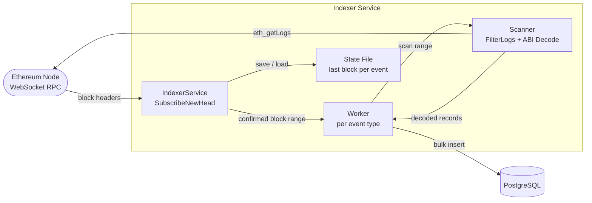
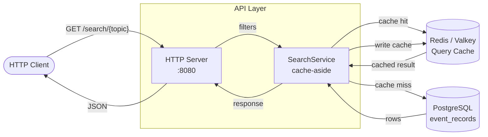

# eth-indexer

A production-grade Ethereum event indexer that captures smart contract events and stores them in PostgreSQL for fast, structured querying.

## Features

- ✅ **Deterministic indexing** - Replaying blocks produces identical results
- ✅ **Idempotent operations** - Document IDs are deterministic (txHash-logIndex)
- ✅ **Reorg-safe** - Only indexes confirmed blocks (configurable depth)
- ✅ **High throughput** - Bulk insertion with automatic block range chunking
- ✅ **Search API** - RESTful API with flexible filtering
- ✅ **Resumable** - Persists indexer state, safe to restart
- ✅ **Real-time** - WebSocket-based block monitoring
- ✅ **Redis caching** - Query result caching for improved performance
- ✅ **Docker-ready** - Complete containerization with docker-compose
- ✅ **Monitoring tools** - Real-time progress tracking
- ✅ **Test suite** - Comprehensive JavaScript/Jest tests (69 tests)

## Quick Start

### Using Docker Compose (Recommended)

1. **Clone and configure:**
```bash
git clone <repository>
cd eth-indexer

# Copy example indexer
cp indexer.example.json indexer.json
```

2. **Edit `config.json`:**
```json
{
  "indexer": {
    "rpc_url": "wss://mainnet.infura.io/ws/v3/YOUR_API_KEY",
    "contract_addresses": [
      "0xA0b86991c6218b36c1d19D4a2e9Eb0cE3606eB48"
    ],
    "event_names": ["Transfer", "Approval"],
    "confirmed_after": 12,
    "offset_block_number": 24600000
  }
}
```

3. **Start all services:**
```bash
docker-compose up -d
```

Services started:
- **PostgreSQL** - Event storage (port 5433)
- **Valkey (Redis)** - Query cache (port 6379)
- **eth-indexer** - Indexer + API (port 8080)
- **Geth** (optional) - Local Ethereum node

4. **Monitor indexing progress:**
```bash
./.scripts/monitor.sh
```

5. **Query events:**
```bash
curl http://localhost:8080/search/Transfer | jq
```

### Using Go Directly

1. **Install dependencies:**
```bash
go mod download
```

2. **Configure (create config.json):**
```json
{
  "indexer": {
    "rpc_url": "wss://mainnet.infura.io/ws/v3/YOUR_API_KEY",
    "contract_addresses": ["0xA0b86991c6218b36c1d19D4a2e9Eb0cE3606eB48"],
    "event_names": ["Transfer"],
    "confirmed_after": 12,
    "offset_block_number": 24600000,
    "status_file_path": "./state/indexer-state.json",
    "abi": [...]
  },
  "postgres": {
    "host": "localhost",
    "port": 5432,
    "database": "eth_indexer",
    "user": "postgres",
    "password": "postgres"
  }
}
```

3. **Run:**
```bash
go run ./cmd/eth-indexer
```

## Configuration

### Complete config.json Structure

```json
{
  "indexer": {
    "rpc_url": "wss://mainnet.infura.io/ws/v3/YOUR_KEY",
    "contract_addresses": [
      "0xA0b86991c6218b36c1d19D4a2e9Eb0cE3606eB48",
      "0xdAC17F958D2ee523a2206206994597C13D831ec7"
    ],
    "event_names": ["Transfer", "Approval"],
    "confirmed_after": 12,
    "offset_block_number": 24600000,
    "status_file_path": "/var/lib/eth-indexer/state/indexer-state.json",
    "abi": [
      {
        "anonymous": false,
        "inputs": [
          {"indexed": true, "name": "from", "type": "address"},
          {"indexed": true, "name": "to", "type": "address"},
          {"indexed": false, "name": "value", "type": "uint256"}
        ],
        "name": "Transfer",
        "type": "event"
      }
    ]
  },
  "postgres": {
    "host": "postgres",
    "port": 5432,
    "database": "eth_indexer",
    "user": "postgres",
    "password": "postgres",
    "max_connections": 20
  },
  "redis": {
    "host": "valkey",
    "port": 6379,
    "password": "",
    "db": 0
  },
  "api": {
    "port": 8080,
    "ttl": 3600
  }
}
```

### Configuration Parameters

| Parameter | Required | Default | Description |
|-----------|----------|---------|-------------|
| `rpc_url` | Yes | - | Ethereum WebSocket RPC endpoint |
| `contract_addresses` | Yes | - | Array of contract addresses to monitor |
| `event_names` | Yes | - | Event names to index |
| `confirmed_after` | No | `12` | Blocks to wait before indexing (reorg protection) |
| `offset_block_number` | No | `0` | Starting block number |
| `status_file_path` | No | - | Path to persist indexer state |
| `abi` | Yes | - | Contract ABI (events section) |

## API Endpoints

### Health Check
```bash
GET /health
```

Response:
```
OK
```

### Indexer Status
```bash
GET /status
```

Response:
```json
{
  "Transfer": 24633142,
  "Approval": 24633142
}
```

### Search Events

```bash
GET /search/{topic}
```

**Topics:** `Transfer`, `Approval`, or any configured event name

#### Example: Get all Transfer events
```bash
curl http://localhost:8080/search/Transfer | jq
```

Response:
```json
{
  "count": 150,
  "result": [
    {
      "contract_address": "0xA0b86991c6218b36c1d19D4a2e9Eb0cE3606eB48",
      "tx_hash": "0x023814f84d48c6796e4c6e458f7f2ef1ac074031fd579fc7af2be97cfc14a1b1",
      "block_hash": "0xf4c508c206d8aeb3ded5bdf028999a341df52a674356b3ea119ddfb9a6a61ee9",
      "block_number": 24633117,
      "log_index": 0,
      "data": {
        "from": "0x0000000000000000000000009250e9ab0ffe3590629746843bb39425c4b2e3da",
        "to": "0x000000000000000000000000f8e16ecc6357c14726cf9bebbce0049b7c93fc63",
        "value": 500
      },
      "timestamp": "2026-03-11T08:47:18.630617Z"
    }
  ]
}
```

### Filter Parameters

All filters are passed as query parameters using GET requests.

#### Contract Address Filter
```bash
# Single contract
curl "http://localhost:8080/search/Transfer?contract_address=0xA0b86991c6218b36c1d19D4a2e9Eb0cE3606eB48"

# Multiple contracts (comma-separated)
curl "http://localhost:8080/search/Transfer?contract_address=0xA0b86991c6218b36c1d19D4a2e9Eb0cE3606eB48,0xdAC17F958D2ee523a2206206994597C13D831ec7"
```

#### Block Number Filter

Use JSON-encoded comparison operators:

```bash
# Greater than or equal (gte)
curl --get "http://localhost:8080/search/Transfer" \
  --data-urlencode 'block_number={"gte":24633120}'

# Less than or equal (lte)
curl --get "http://localhost:8080/search/Transfer" \
  --data-urlencode 'block_number={"lte":24633130}'

# Range (gte + lte)
curl --get "http://localhost:8080/search/Transfer" \
  --data-urlencode 'block_number={"gte":24633120,"lte":24633130}'

# Exact match (eq)
curl --get "http://localhost:8080/search/Transfer" \
  --data-urlencode 'block_number={"eq":24633120}'
```

Supported operators: `gte`, `lte`, `gt`, `lt`, `eq`

#### Transaction Hash Filter
```bash
curl "http://localhost:8080/search/Transfer?tx_hash=0x023814f84d48c6796e4c6e458f7f2ef1ac074031fd579fc7af2be97cfc14a1b1"
```

#### Block Hash Filter
```bash
curl "http://localhost:8080/search/Transfer?block_hash=0xf4c508c206d8aeb3ded5bdf028999a341df52a674356b3ea119ddfb9a6a61ee9"
```

#### Log Index Filter
```bash
# Single index
curl "http://localhost:8080/search/Transfer?log_index=0"

# Multiple indices (comma-separated)
curl "http://localhost:8080/search/Transfer?log_index=0,1,2"
```

#### Combined Filters
```bash
curl --get "http://localhost:8080/search/Transfer" \
  --data-urlencode 'contract_address=0xA0b86991c6218b36c1d19D4a2e9Eb0cE3606eB48' \
  --data-urlencode 'block_number={"gte":24633120,"lte":24633130}' \
  --data-urlencode 'log_index=0'
```

## Utility Scripts

### Monitor Indexing Progress
```bash
./.scripts/monitor.sh
```

Real-time monitoring showing:
- Current block for each event type
- Blocks indexed per minute
- Progress indicators

### Connect to PostgreSQL
```bash
# Interactive session
./.scripts/psql.sh

# Execute query
./.scripts/psql.sh -c "SELECT COUNT(*) FROM event_records;"

# List tables
./.scripts/psql.sh -c "\dt"

# Show recent events
./.scripts/psql.sh -c "SELECT * FROM event_records ORDER BY timestamp DESC LIMIT 10;"
```

## Testing

### JavaScript Test Suite (Jest)

Comprehensive test suite with 69 tests covering all API functionality.

```bash
cd test
npm install
npm test
```

**Test Coverage:**
- Health and status endpoints (9 tests)
- Search functionality (16 tests)
- All filter types (15 tests)
- Error handling (19 tests)
- Performance benchmarks (10 tests)

**Run specific test suites:**
```bash
npm run test:health       # Health tests only
npm run test:search       # Search tests only
npm run test:filters      # Filter tests only
npm run test:errors       # Error handling tests only
npm run test:performance  # Performance tests only
```

**Coverage report:**
```bash
npm run test:coverage
```

See [test/README.md](test/README.md) for detailed testing documentation.

### Go Tests
```bash
go test ./...
```

## Architecture

### Indexing Pipeline



### Query Pipeline



### Key Components

- **Indexer Service**: Manages WebSocket subscription and broadcasts new block headers to all workers
- **Workers**: Per-event goroutines; calculate confirmed block range and dispatch scan requests
- **Scanner**: Calls `eth_getLogs` RPC, validates topic0, and ABI-decodes indexed + non-indexed fields
- **Storage**: PostgreSQL with composite primary key `(tx_hash, log_index)` for idempotent bulk inserts
- **Cache**: Redis/Valkey — deterministic key from `xxhash64(msgpack(filters))`, configurable TTL
- **State**: JSON file tracking last indexed block per event; enables safe resumption after restarts
- **API Server**: RESTful API with flexible filtering (block range, contract address, JSONB data, etc.)

## Database Schema

### event_records Table

```sql
CREATE TABLE event_records (
    topic TEXT NOT NULL,
    contract_address VARCHAR(42) NOT NULL,
    tx_hash VARCHAR(66) NOT NULL,
    block_hash VARCHAR(66) NOT NULL,
    block_number BIGINT NOT NULL,
    log_index BIGINT NOT NULL,
    data JSONB NOT NULL DEFAULT '{}',
    timestamp TIMESTAMPTZ NOT NULL DEFAULT NOW(),

    PRIMARY KEY (tx_hash, log_index)
);
```

### Indexes

- `idx_event_records_topic` - Fast filtering by event type
- `idx_event_records_contract_address` - Contract-specific queries
- `idx_event_records_block_number` - Block range queries
- `idx_event_records_timestamp` - Time-based queries
- `idx_event_records_data` (GIN) - JSONB field queries
- `idx_event_records_topic_block` - Combined topic + block queries

## Document ID Format

Documents use a composite primary key for idempotency:

```
PRIMARY KEY (tx_hash, log_index)
```

This prevents duplicate indexing and allows safe re-indexing of blocks.

## Performance

### Benchmarks

- **API Response Time**: 14ms average
- **Concurrent Requests**: Handles 20+ concurrent requests
- **Indexing Speed**: ~2 blocks per 15 seconds (real-time)
- **Query Performance**: <500ms for filtered queries

### Automatic Block Range Chunking

The indexer automatically handles high-volume contracts:
- Starts with 50-block chunks
- Reduces chunk size when hitting RPC limits
- Works with any RPC provider's rate limits
- Handles contracts with 10,000+ events per block

## RPC Provider Recommendations

### For Production
- **Alchemy** (recommended): Higher rate limits, WebSocket support
- **Infura**: Reliable, WebSocket support
- **QuickNode**: Fast, dedicated nodes available

### For Development
- **Public nodes**: Free but strict rate limits
- **Local Geth**: Best for testing, no rate limits

### WebSocket Required

The indexer uses `SubscribeNewHead` for real-time block monitoring, which requires WebSocket support. HTTP-only endpoints will not work.

## Production Considerations

### 1. Confirmation Depth
Set `confirmed_after` based on chain finality:
- **Ethereum mainnet**: 12+ blocks
- **L2s (Optimism, Arbitrum)**: 1-5 blocks
- **Sidechains**: Varies by chain

### 2. Starting Block
- Set `offset_block_number` to recent block for initial testing
- Start from block 0 only if you need complete history
- Consider backfilling separately for large ranges

### 3. Database Tuning
```sql
-- Increase shared buffers for better performance
-- In postgresql.conf:
shared_buffers = 256MB
effective_cache_size = 1GB
```

### 4. Monitoring
- Use `./scripts/monitor.sh` for real-time progress
- Monitor PostgreSQL connections: `./scripts/psql.sh -c "\conninfo"`
- Check Docker logs: `docker-compose logs -f indexer`

### 5. High-Volume Contracts
For contracts like USDC/USDT with thousands of events per block:
- The chunking feature handles this automatically
- Consider indexing fewer contract addresses per instance
- Use Redis caching to reduce database load

### 6. Error Handling
The indexer automatically retries on:
- RPC connection failures
- Rate limit errors (with exponential backoff)
- Temporary database issues

Fatal errors that require intervention:
- Invalid ABI configuration
- Database connection failures
- WebSocket subscription failures

## Troubleshooting

### Indexer Not Processing Blocks

1. Check RPC connection:
```bash
docker-compose logs indexer | grep "Starting eth-indexer"
```

2. Verify WebSocket support:
```bash
# Should start with wss://
curl http://localhost:8080/status
```

3. Check for errors:
```bash
docker-compose logs indexer | grep -i error
```

### No Events Being Indexed

1. Verify contract addresses and event names in config
2. Check if blocks have been scanned:
```bash
curl http://localhost:8080/status
```
3. Query database directly:
```bash
./.scripts/psql.sh -c "SELECT COUNT(*) FROM event_records;"
```

### Performance Issues

1. Check database indexes:
```bash
./.scripts/psql.sh -c "\di"
```

2. Monitor query performance:
```bash
./.scripts/psql.sh -c "SELECT * FROM pg_stat_statements ORDER BY mean_exec_time DESC LIMIT 10;"
```

3. Verify Redis is running:
```bash
docker-compose ps valkey
```

## Development

### Project Structure
```
eth-indexer/
├── api/              # API handlers and server
├── cmd/eth-indexer/  # Main application entry
├── config/           # Configuration loading
├── core/             # Core domain types and interfaces
├── scanner/          # Event scanning and ABI decoding
├── service/          # Business logic (indexer, search)
├── storage/          # Database implementations
├── scripts/          # Utility scripts
├── test/             # JavaScript test suite
├── migrations/       # Database migrations
└── state/            # Indexer state persistence
```

### Build
```bash
make build
# or
go build -o bin/eth-indexer ./cmd/eth-indexer
```

### Docker Build
```bash
docker build -t eth-indexer:latest .
```

### Adding New Events

1. Update `config.json` with new event name
2. Add event definition to ABI array
3. Restart indexer
4. New events will be indexed automatically

## License

MIT

## Contributing

Contributions are welcome! Please:
1. Fork the repository
2. Create a feature branch
3. Add tests for new functionality
4. Submit a pull request

## Support

For issues and questions:
- Open an issue on GitHub
- Check existing issues for solutions
- Review the troubleshooting section above
